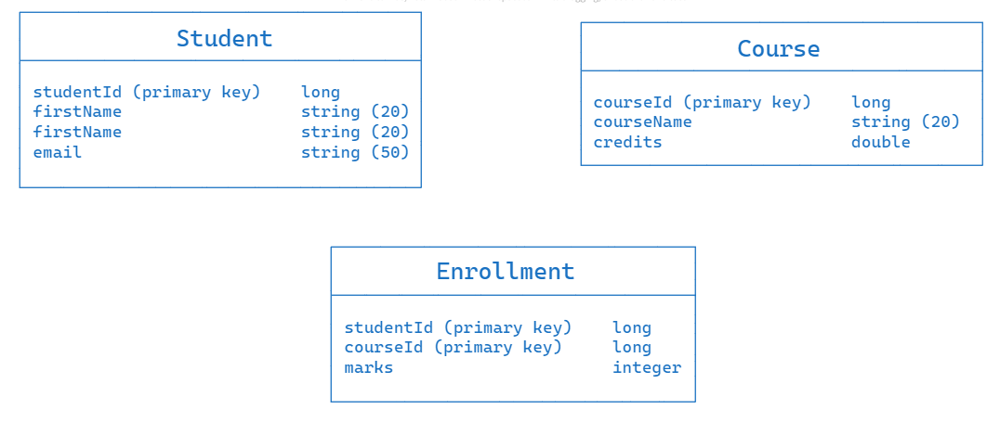

# Course management

Language used for backend development: Python (flask framework)

### API Codes used

- 200: OK
- 400: Bad request / Invalid argument (invalid request payload)
- 404: Not found
- 409: Conflict response status code indicates a request conflict with the current state of the target resource
- 415: Header is missing

### Project Hierarchy

```
project
    |- main.py
    |- enrollment_utilities
    |    |- enroll.py
    |    |- unenroll.py
    |    |- updateMmarks.py
    |- functionalities
    |    |- createStudent.py
    |    |- fetchSingleStudent.py
    |    |- fetchAllStudent.py
    |    |- deleteSingleStudent.py
    |    |- createCourse.py
    |    |- fetchSingleCourse.py
    |    |- fetchAllCourse.py
    |    |- deleteSingleCourse.py
    |    |- getCourseSingleStudent.py
    |    |- getStudentSingleCourse.py
    |- utils
    |    |- db.py
    |    |- seed.py
    |- instance
    |   |- course_management.db
    |- README.md
    |- images
        |- database_image.png
```

### Database Structure


### Running the Application
Install Flask:
```
pip install Flask
```
Install Flask SQLAlchemy:
```
pip install Flask-SQLAlchemy
```
Run the application:
```
python main.py
```
or
```
python main.py
```
The application will start running on `http://127.0.0.1:8000/`

### Seeding the Database with Mock Data
To seed the database with dummy data from `seed.py` file

To seed the database with mock data just send a request to `/seed` with the `GET` method

The mock data for `Student` table is as follows

The mock data for `Course` table is as follows

The mock data for `Enrollment` table is as follows

### Testing the functionalities on Postman
**1. Create a student using POST mapping with API endpoint api/students/**

**2. Fetch a single student using GET mapping with API endpoint api/students/{id}**

**3. Fetch all students using GET mapping with API endpoint api/students/**

**4. Delete a specific student using DELETE mapping with API endpoint api/students/{id}**

**5. Get courses for a specific student using GET mapping with API endpoint api/students/{id}/courses**

**6. Create a course using POST mapping with API endpoint api/courses/**

**7. Fetch a single course using GET mapping with API endpoint api/courses/{id}**

**8. Fetch all courses using GET mapping with API endpoint api/courses/**

**9. Delete a specific course using DELETE mapping with API endpoint api/courses/{id}**

**10. Get students for a specific course using GET mapping with API endpoint api/courses/{id}/students**

**11 Get the most enrolled course using GET mapping with API endpoint api/courses/most-enrolled**

**12 Get the highest marks scored in a specific course by a student using GET mapping with API endpoint api/courses/highest-marks/{courseId}**

**13. Enroll a specified student in a course by using POST mapping with API endpoint api/enrollments/enroll. This should add student, and course objects to the Enrollment table**

**14. Unenroll a specified student from a course by using DELETE mapping with API endpoint api/enrollments/unenroll**

**15. Update marks for a particular student in a specified course by using PUT mapping with API endpoint api/enrollments/updateMarks**